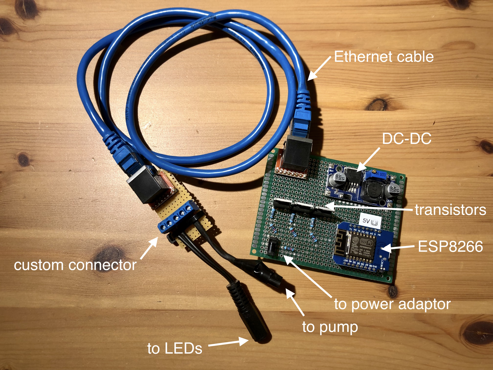

# Hydropomic Smart Garden Controller

Controller and web UI for a modified
[IDOO hydroponic growing system](https://www.idooworld.com/collections/hydroponics-grow-planter/products/idoo-indoor-garden-starter-kit-7-pods) using an ESP8266 microcontroller.

IDOO's hydroponic systems are controlled using on-device buttons. This project
replaces all circuit boards with an ESP8266 microcontroller
plus some additional electronics to control LEDs and pump.

This allows for remote control via a web UI and custom LED and pump settings. In
addition, this project could easily be extended using sensors, for example to
check water or nutrition levels.

That said, the main motivation for this modification was that the original IDOO 
circuit boards suffered from water damage, thus bricking the system.

## Installation

The [web UI](src/ui) is written in HTML and CSS. A custom
[parser](tools/parse-html.js) then turns HTML into C code (essentially a series of
`Serial.println` statements). The parser replaces some HTML elements with
dedicated function calls to render dynamic states (e.g., for toggles). It also points the
stylesheet link to an external host (configured in [package.json](package.json)).

The scenes (normal, grow, enjoy) replicate IDOO's original light and timing
settings (but based on absolute clock times). If light mode is set to
auto, these timing settings are used. If set to on or off, lights are permanently
on or off. The pump alternates between on and off
every 30 minutes. 

### Prepare UI
1. Upload [css](css) and [images](images) folders to a public host
1. Set `host` accordingly in [package.json](package.json) (e.g., "https://my.cdn.com/files")
1. Run `npm install`
1. Run `npm run make` to generate C code that renders HTML

### Configure Controller
1. Download and install the [Ardunio IDE](https://www.arduino.cc/en/software/)
1. Edit [sketch file](src/sketch/controller/controller.ino)
   - Set Wifi `ssid` and `password`
   - Set pins (`PIN_LED_RED`, `PIN_LED_BlUE`, `PIN_PUMP`)
   - Put generated C code from output/html-doc.c at the bottom of the sketch
1. Upload to microcontroller

### Test
1. Open Arduino IDE's serial monitor
1. Retrieve IP address and open in browser (e.g., http://192.168.1.68)

## Hardware

All components but the two original circuit boards (one in the base unit and
one in the lamp shade) are re-used—in particular LEDs, pump, power adapter, and
some of the wiring. Note that the top-buttons are non-functional after the
modification.

This setup is in parts still a bit crude, but it works. It uses the original
24V power supply and a DC-DC converter to power the ESP8266. In the picture,
a NodeMCU board is connected via jumper cables, but this is supposed to be
replaced by a smaller D1 Mini. Three MOSFETs (IRLZ 44N) are used to control
LEDs (two colors) and pump.